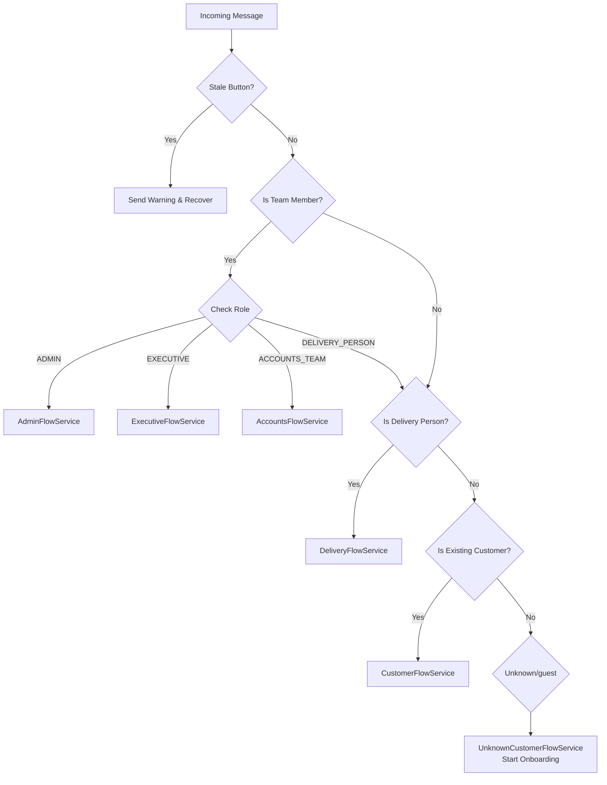

# WhatsApp Message Flows

This document outlines the message dispatching logic handled by `WhatsAppDispatcherService`.

## Dispatcher Logic

The system identifies the sender's role based on their phone number and dispatches the message to the appropriate service.

## Service Responsibilities

| Service | Role / Function |
| :--- | :--- |
| **AdminFlowService** | Handles messages from Administrators (Product management, user management). |
| **ExecutiveFlowService** | Handles messages from Executives (Order oversight). |
| **DeliveryFlowService** | Handles Delivery Personnel interactions (Order pickup/delivery). |
| **AccountsFlowService** | Handles Accounts Team interactions (Payment verification). |
| **CustomerFlowService** | Handles registered customer shopping flows. |
| **UnknownCustomerFlowService** | Handles registration and onboarding for new numbers. |
